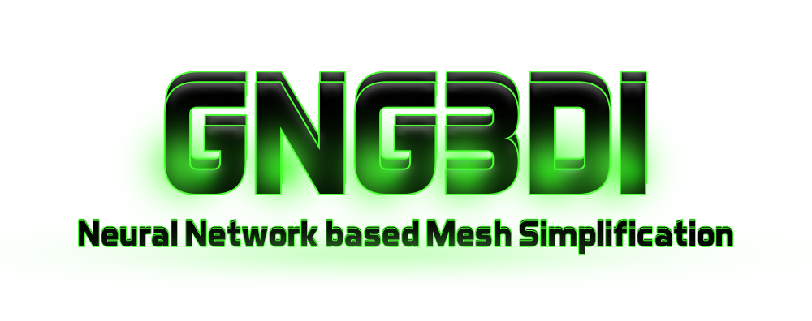

Written by Alin Andersen.

Interactive implementation of the GNG3D algorithm.
GNG3DI allows to load a 3D mesh and rebuild it using the GNG3D algorithm.
It allows the user to see the changes in real time and change the parameters of the algorithm.

